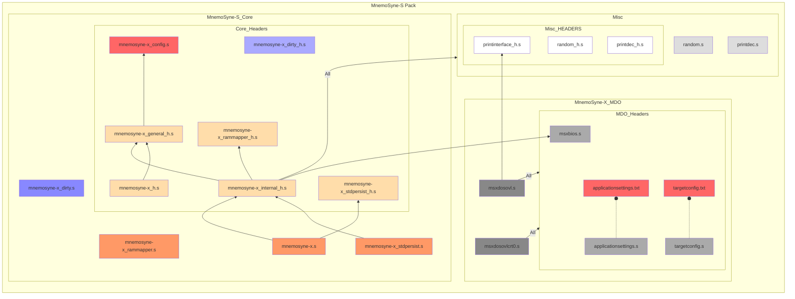

# MnemoSyne-X
## A Virtual Memory system for MSX.

### Version 00.00.01 preview

May, 2024 
Damned Angel

---

## Introduction
**MnemoSyne-X** is a Virtual Memory System developed for the MSX platform,
designed to provide programmers with a simple interface to manage 
mapped RAM memory effectively and efficiently.

**MnemoSyne-X** allows for up to 1Gb of addressable memory, divided in 65535
segments of 16kbytes each.

The objective if **MnemoSyne-X** is to unleash MSX RAM Mapper cababilities,
paving the way for innovative MSX-DOS/Nextor applications and games on
the platform.

---

## Integration
**MnemoSyne-X** is distributed with a core module integrated in an 
[MDO (MSX-DOS Overlay)](https://github.com/DamnedAngel/MSX-Templates-for-VisualStudio/blob/master/doc/manual.md#running-your-msx-dos-program-with-overlays-in-webmsx),
as show in the diagram below.

The core module may be integrated directly to the MSX-DOS/Nextor
executable, however. Since **MnemoSyne-X** manages segments in
pages 1 and 2, it must sit on pages 0 or 3. The MDO provided is,
by default, to be dinamycally loaded in the beginning of page 3.

### Using **MnemoSyne-X** in an MDO (MSX-DOS Overlay)
When using **MnemoSyne-X** in the 
[MDO format](https://github.com/DamnedAngel/MSX-Templates-for-VisualStudio/blob/master/doc/manual.md#running-your-msx-dos-program-with-overlays-in-webmsx),
the developer must create, in addition to the MDO, an MSX-DOS application with the MSX-DOS
template available
[here](https://github.com/DamnedAngel/MSX-Templates-for-VisualStudio/releases/tag/v00.06.01)
and configure both projects, as described below:

1. In ApplicationProject -> ApplicationSettings.txt, set **MDO_SUPPORT** to  **_ON**.

2. In ApplicationProject -> MDOSettings.txt, add the following hooks:

    ; --- MnemoSyneX ---
    MDO_HOOK		unsigned char|mnemo_init|(bool)
    MDO_HOOK		void|mnemo_finalize|(void)

    MDO_HOOK		void|mnemo_setStdPersistence|(unsigned char)
    MDO_HOOK		void|mnemo_setPersistence|(unsigned char, unsigned int, unsigned int)

    MDO_HOOK		unsigned char|mnemo_activateLogSeg|(LOGSEGHANDLER*)
    MDO_HOOK		unsigned char|mnemo_releaseLogSeg|(unsigned char, LOGSEGHANDLER*)		; SDCCCALL(1)
    MDO_HOOK		unsigned char|mnemo_releaseLogSegHL|(unsigned char, LOGSEGHANDLER*)		; ASM ONLY!!!
    MDO_HOOK		unsigned char|mnemo_releaseAll|(unsigned char)
    MDO_HOOK		unsigned char|mnemo_flushAll|(void)

    MDO_HOOK		void|mnemo_switchAuxPage|(LOGSEGHANDLER*)
    MDO_HOOK		void|mnemo_switchMainPage|(LOGSEGHANDLER*)

    MDO_HOOK		unsigned int |mnemo_getManagedSegments|(void)
    MDO_HOOK		unsigned int |mnemo_getUsedSegments|(void)
    MDO_HOOK		unsigned int |mnemo_getFreeSegments|(void)

3. In ApplicationProject -> MDOSettings.txt ->, declare an MDO child:  **MDO_CHILD		MNEMOSYNEX	^/MNEMOSX / DRV #0xc000**

4. In MnemoSyne-X -> MDOSettings, configure **MDO_APPLICATION_PROJECT_PATH** with the **\<path to .COM project\>**.

5. In MnemoSyne-X -> MDOSettings, configure **MDO_PARENT_PROJECT_PATH** with the **\<path to .COM project\>**.

6. Optionally, in MnemoSyne-X -> TargetConfig_Debug.txt, configure **MSX_BIN_PATH** with **\<path to .COM project\>\\[PROFILE]\bin

6. Optionally, in MnemoSyne-X -> TargetConfig_Release.txt, configure **MSX_BIN_PATH** with **\<path to .COM project\>\\[PROFILE]\bin

8. In ApplicationProject -> Include Directories.txt, add **\<path to MnemoSyne-X\>\\source**

9. In ApplicationProject -> Include Directories.txt, add **\<path to MnemoSyne-X\>\\misc**

10. In C application source, add the line **#include \<stdbool.h\>**

11. In C application source, add the line **#include "mnemosyne-x.h"** _BEFORE_ **#include "mdointerface.h"**

12. In ASM application source, add the line **#include "mnemosyne-x_h.s"**

13. Add code to (example project available):
13.1. Load and Link MnemoSyne-X MDO:

	// ----------------------------------------------------------
	// Load & Link MDO
	// ----------------------------------------------------------
    // load MnemoSyne-X MDO
	unsigned char r = mdoLoad(&MNEMOSYNEX);
	if (r) {
		print("Error loading MDO.\r\n\0");
		return r;
	}
	dbg("MDO loaded successfully.\r\n\0");

	// link MnemoSyne-X MDO
	r = mdoLink(&MNEMOSYNEX);
	if (r) {
		print("Error linking MDO.\r\n\0");
		return r;
	}
	dbg("MDO linked successfully.\r\n\0");

13.2. Unlink and Release MnemoSyne-X MDO:

	// ----------------------------------------------------------
	// Unload and Release MDO
	// ----------------------------------------------------------
	// unlink MnemoSyne-X MDO
	r = mdoUnlink(&MNEMOSYNEX);
	if (r) {
		print("Error unlinking MDO.\r\n\0");
		return r;
	}
	dbg("MDO unlinked successfully.\r\n\0");

	// release MnemoSyne-X MDO
	r = mdoRelease(&MNEMOSYNEX);
	if (r) {
		print("Error releasing MDO.\r\n\0");
		return r;
	}
	dbg("MDO released successfully.\r\n\0");

14. In ApplicationProject -> Symbols.txt, replace the line **\_[a-zA-Z0-9]\*\_hook** with **\_[a-zA-Z0-9\_]\*\_hook** (This is a Bug in the MSX-DOS template. Will be solved in the future).

15. In ApplicationProject -> Symbols.txt, add the line **printchar** (also a bug to be corrected in the MSX-DOS template).

16. Either add random.s to the MnemoSyne-X MDO project 
(MnemoSyne-X -> ApplicationSources.txt ->  ../misc/random.s) or your application project and 
export the symbol to the MDO adding it to application's Symbols.txt file.
16.1. Idem to _PrintDec (../misc/printdec.s).
16.2. In the example, both are added to the application and the symbols exported to the MDO.

All these steps are contemplated in the **MDOMnemoSyne-XDemo** bundled in **MnemoSyne-X** package.

Be sure to read the
[MDO Basics](https://github.com/DamnedAngel/MSX-Templates-for-VisualStudio/blob/master/doc/manual.md#running-your-msx-dos-program-with-overlays-in-webmsx)
in order to learn how to configure your project to take full
advantage of MDOs, how to dynamically load the MDO and how to access
its API from your application.

### Integrating **MnemoSyne-X** inside your executable
In order to directly integrate **MnemoSyne-X** to your MSX-DOS/Nextor
Application without MDOs, ignore the _mdo_ folder in the package,
include the sources in the diagram above to your project, and use

    .include "mnemosyne-x_h.s"

in your program to access **MnemoSyne-X**'s API. **mnemosyne-x_h.s**
already includes **mnemosyne-x_general_h.s** to provide the programmer
with useful **MnemoSyne-X** constants.

**In all cases**, remember to configure **MnemoSyne-X** in
**mnemosyne-x_config_h.s**. More on this in the
[Configuration Section](#configuration) below.

---

## Architecture

### Page Structure
The standard MSX architecture define 4 pages to divide the 64kbytes
addressable by the Z80 (page 0 from 0x0000 to 0x3fff, page 1 from 0x4000 to
0x7fff, page 2 from 0x8000 to 0xbfff and page 3 from 0xc000 to 0xffff).
**MnemoSyne-X** uses page 1 and 2 to operate. One of these pages will
be **MnemoSyne-X**'s **MAIN** page and the other **MnemoSyne-X**'s **AUX**
page.

**AUX** page is more easily shared with the application. It is used by
**MnemoSyne-X**'s internal operations, but that should be transparent to 
the programmer and **MnemoSyne-X** will always restore user's segment in
**AUX** page before returning from a service routine (except from 
**_mnemo_switchAuxPage**).

If should be safe to call **MnemoSyne-X**'s API from a user routine in 
**AUX** page.

**MAIN** page is where **MnemoSyne-X** will make segments availble after
allocating them.

The configuration **MNEMO_MAIN_SWAP_PAGE** in **mnemosyne-x_config_h.s**
will define which page will be considered the **MAIN** and **AUX** pages
by **MnemoSyne-X**. Please check [Configuration Section](#configuration)
for further info.

### Logical Segments
Logical Segments are identifiable and manage instances of standard MSX
Physical Segments in RAM mappers.

**MnemoSyne-X**, in its full configuration, identifies and manages at
most 65565 logical segments (64k minus 1, since segment identifier
*0xffff* is used to denote an invalid segment).

A Logical Segment may be made available by **MnemoSyne-X** in its
**MAIN** or **AUX** page (more on this in the
[Page Structure Section](#page-structure) above).

**MnemoSyne-X**'s Logical Segment, following the standard RAM mapper
segment in the MSX architecture, has 16kbytes, but its first 16 bytes
are reserved for the header. The structure of the Logical Segment Header 
is:

    typedef struct {
    	unsigned int logSegNumber;
    	unsigned char segMode;
    	unsigned char loadHook;         // load hook byte 1: always 0xc3 (jp)
    	unsigned int pLoadSeg;          // load hook bytes 2 and 3: address of segment load routine
    	unsigned char loadHook;         // save hook byte 1: always 0xc3 (jp)
    	unsigned int pLoadSeg;          // save hook bytes 2 and 3: address of segment save routine
    	unsigned char reserved9;
    	unsigned char reserved10;
    	unsigned char reserved11;
    	unsigned char reserved12;
    	unsigned char reserved13;
    	unsigned char reserved14;
    	unsigned char reserved15;
    } LOGSEGHEADER;

Normally, the programmer doesn't have to care about a Logical Segment's
header, though, as long as these 16 bytes are honored.

### Databanks

**Databanks** are swap files dedicated to holding segment backups. Up to 
256 segments may be stored in one **Databank**, and a maximum of 256
**Databanks** may exist.

Since each segment holds 16kbytes, a maximum 16bytes * 256 * 256 = 1GByte
Virtual Memory may be managed by **MnemoSyne-X**.

Each **Databank** file will be named XXXXXXXX._NN, where:
- XXXXXXXX is a string hardcoded in **MnemoSyne-X** sources; and
- NN is the 0-padded hexadecimal representation of the **Databank** number.

The number of the **Databank** in which a given Logical Segment, among the
64564 possible Logical Segments, will be stored is the Segment Number DIV
256, or the MSByte of the (16-bit) Segment Number. Segments don't need
to be stored in order inside a **Databank**; every **Databank** has an
index in its beginning with the references to the Segments withing it. As
a consequence, **Databanks** are pontentially incomplete, meaning that it
is likely that a **Databank** will not be holding the 256 segments it 
could hold.

---

## API

**MnemoSyne-X** provides an API to manage physical and, mainly,
logical segments.

Please find below the complete list of **MnemoSyne-X** API routines.
Note that C headers are also provided to allow direct integration
to C projects (SDCCCALL(1) must be used).

### _mnemo_init

    ; ----------------------------------------------------------------
    ;	- Init MnemoSyne-X.
    ; ----------------------------------------------------------------
    ; INPUTS:
    ;	- A: Use primary mappers only (if MNEMO_PRIMARY_MAPPER_ONLY = 0).
    ;			0 = All mappers
    ;			1 = Primary mapper only
    ;
    ; OUTPUTS:
    ;   - A:  0 = Success
    ;
    ; CHANGES:
    ;   - All registers
    ; ----------------------------------------------------------------

**_mnemo_init** initializes **MnemoSyne-X** subsystem and must be
called before any other accesses to the system. If initialization
succeeds, register A is set to 0. Any other value denotes a failure.

### _mnemo_finalize

    ; ----------------------------------------------------------------
    ;	- Finalize MnemoSyne-X.
    ; ----------------------------------------------------------------
    ; INPUTS:
    ;	- None
    ;
    ; OUTPUTS:
    ;   -None
    ;
    ; CHANGES:
    ;   - All registers
    ; ----------------------------------------------------------------

**_mnemo_finalize** finalizes **MnemoSyne-X** subsystem and releases
mapper segments. It receives no parameters and returns nothing.

It is a good practice to call **_mnemo_finalize** before exiting to
MSX-DOS/Nextor.

### _mnemo_setStdPersistence

    ; ----------------------------------------------------------------
    ;	- Set a bank to standard persistence
    ; ----------------------------------------------------------------
    ; INPUTS:
    ;	- A: Bank number
    ;
    ; OUTPUTS:
    ;	- None
    ;
    ; CHANGES:
    ;   - All regs
    ; ----------------------------------------------------------------

**_mnemo_setStdPersistence** associates **MnemoSyne-X**'s standard
persistence routines (Load and Save) to a given Databank. Databank
number (0-255) must be especified in register A before calling
**_mnemo_setStdPersistence**.

The standard persistence routines are default for all Databanks.

### _mnemo_setPersistence

    ; ----------------------------------------------------------------
    ;	- Set bank persistence
    ; ----------------------------------------------------------------
    ; INPUTS:
    ;	- A: Bank number
    ;	- DE: pLoadSeg
    ;   - Stack: pSaveSeg
    ;
    ; OUTPUTS:
    ;	- None
    ;
    ; CHANGES:
    ;   - All regs
    ; ----------------------------------------------------------------

**_mnemo_setPersistence** associates custom persistence routines
(Load and Save) to a given Databank. Pior to calling
**_mnemo_setPersistence**, Databank number (0-255) must be especified
in register A, DE must point to the custom segment load routine 
(pLoadSeg) and the address of the custom segment load routine
(pSaveSeg) must be pushed to the stack.

In order to comply to SSDCCCALL(1) standard, **_mnemo_setPersistence**
will clean pSaveSeg from the stack. The callee doesn't need to bother
with it.

Custom persistence routines are not needed in many cases. They are,
however, interesting to provide way of having custom Databank formats
(compressed segments, for instance), to allow for procedural data
generation (i.e. random levels for a game), or simply accessing
different medias (mapped drives, internet access, whatever).

### _mnemo_activateLogSeg

    ; ----------------------------------------------------------------
    ;	- Activates a logical segment
    ; ----------------------------------------------------------------
    ; INPUTS:
    ;	- HL: pointer to logical segment handler
    ;
    ; OUTPUTS:
    ;   - A:  0 = Success
    ;
    ; CHANGES:
    ;   - All registers
    ; ----------------------------------------------------------------

**_mnemo_activateLogSeg** allocates a logical segment, activating it 
in memory and making it available for the user program. HL must point
to a Logical Segment Handler.

The Logical Segment Handler is defined as:

    typedef struct {
    	SEGHANDLER segHandler;
    	SEGHANDLER* pSegHandler;
    	void* pLogSegTableItem;
    	unsigned int logSegNumber;
    	unsigned char segMode;
    } LOGSEGHANDLER;

The (physical) Segment Handler (SEGHANDLER) is defined as:

    typedef struct {
    	unsigned char segNumber;
    	unsigned char mapperSlot;
    } SEGHANDLER;

Upon calling **_mnemo_activateLogSeg**, the only relevant fields
in the Logical Segment Handler pointed by HL that must be already
filled are **logSegNumber** (a number between 0 and 65364), and 
**segMode** (the mode the segment will operate). The possible modes
are:

    MNEMO_SEGMODE_TEMP			= 0
    MNEMO_SEGMODE_READ			= 1
    MNEMO_SEGMODE_FORCEDREAD		= 2
    MNEMO_SEGMODE_READWRITE			= 3

**MNEMO_SEGMODE_TEMP (0)** indicates that the segment will not be
saved to or retrieved from disk. Once released, the data is simply
discarded when MnemoSyne-X needs to reuse the physical segment.

**MNEMO_SEGMODE_READ (1)** signifies that the segment will be read
from disk if a persisted version is found on Databanks each time the
segment is allocated. After the segment has been released:
- Upon reallocation:
  - If the segment remains consistent, MnemoSyne-X will make it available again upon reallocation.
  - If the segment is no longer available, MnemoSyne-X will reread data from disk (if available).
- When MnemoSyne-X needs to reuse the physical segment, the data is discarded.

**MNEMO_SEGMODE_FORCEDREAD (2)** indicates that the segment will be
read from disk every time it's allocated or reallocated, even if the
in-memory segment is still consistent. This is useful for reloading
game levels after gameplay destroys them. Upon release, when
**MnemoSyne-X** needs to reuse the physical segment, the data is
discarded.

**MNEMO_SEGMODE_WRITE (3)** means that the segment will be read from
disk upon allocation and, after release, when **MnemoSyne-X** needs
to reuse the physical segment, the data is persisted to Databanks.

When selecting a Physical Segment to allocate the requested Logical
Segment, **_mnemo_activateLogSeg** will do its best to keep the other 
Logical Segments consistent and in memory, in order to avoid the
need to persist them to Databanks and to reload it afterwards. To
do so, the following precedence is used:

1. Try to use unused Physical Segments; if not available
1. Try to reuse segments released with NEMO_ALLOC_KEEPPRIORITY0\*; if not available
1. Try to reuse segments released with NEMO_ALLOC_KEEPPRIORITY1\*; if not available
1. Try to reuse segments released with NEMO_ALLOC_KEEPPRIORITY2\*; if not available
1. Fail.

\* For further info on releasing segments and release priority, please
refer to [_mnemo_releaseLogSeg](#_mnemo_releaseLogSeg).

Thus, it is very important, performace-wise, that the programmer 
chooses properly the release priority when releasing segments.

Upon successful allocation, register A is set to 0, the remaining
fields of the Logical Segment Handler are populated (typically, of no
concern to the programmer), and the newly allocated segment will be
made available for use in **MnemoSyne-X**'s **MAIN** page (see 
[Page Structure Section](#page_structure)). Any other value returned
in register A indicates either failure (bit 7 set) or a warning (bit
7 reset).

### _mnemo_releaseLogSeg

    ; ----------------------------------------------------------------
    ;	- Releases segment from a logSegHandler pointed by DE
    ; ----------------------------------------------------------------
    ; INPUTS:
    ;	- A: Release priority
    ;	- DE: pLogSegHandler
    ;
    ; OUTPUTS:
    ;   - None
    ;
    ; CHANGES:
    ;   - All registers
    ; ----------------------------------------------------------------

**_mnemo_releaseLogSeg** releases an allocated logical segment.
Register A must specify the release priority and DE must point to the
Logical Segment Handler (see
[_mnemo_activateLogSeg](#_mnemo_activateLogSeg)) to be released.

The release priority are the following:

    MNEMO_ALLOC_KEEPPRIORITY0				= 0b00000000	; lowest priority
    MNEMO_ALLOC_KEEPPRIORITY1				= 0b00010000	
    MNEMO_ALLOC_KEEPPRIORITY2				= 0b00100000	; highest priority

To learn more how the release priorities are used by **MnemoSyne-X** 
please refer to [_mnemo_activateLogSeg](#_mnemo_activateLogSeg).

### mnemo_releaseLogSegHL

    ; ----------------------------------------------------------------
    ;	- Releases segment from a logSegHandler pointed by HL
    ; ----------------------------------------------------------------
    ; INPUTS:
    ;	- A: Release priority (0 - 2)
    ;	- HL: pointer to logical segment handler
    ;
    ; OUTPUTS:
    ;   - A: Error code
    ;
    ; CHANGES:
    ;   - All registers
    ; ----------------------------------------------------------------

Same as above, but the Logical Segment Handler is passed on HL.

### _mnemo_releaseAll
    ; ----------------------------------------------------------------
    ;	- Releases all active segments
    ; ----------------------------------------------------------------
    ; INPUTS:
    ;	- A: Release priority (0 - 2)
    ;
    ; OUTPUTS:
    ;   - None
    ;
    ; CHANGES:
    ;   - All registers
    ; ----------------------------------------------------------------

**_mnemo_releaseAll** will scan the physical segments pool and release
every active logical segment it finds. The release priority for all
these segments shall be passed on register A.

## _mnemo_flushAll

    ; ----------------------------------------------------------------
    ;	- Flushes all pending, released segments to disk
    ; ----------------------------------------------------------------
    ; INPUTS:
    ;	- None
    ;
    ; OUTPUTS:
    ;   - A: Error code
    ;
    ; CHANGES:
    ;   - All registers
    ; ----------------------------------------------------------------

**_mnemo_flushAll** will release and persist all non-persisted
segments with mode **MNEMO_SEGMODE_READWRITE** to disk. If the flush
process succeeds, register A is set to 0. Any other value denotes 
a failure.

### _mnemo_switchAuxPage

    ; ----------------------------------------------------------------
    ;	- Enable a segment from a Segment Handler in aux page
    ; ----------------------------------------------------------------
    ; INPUTS:
    ;	- HL: pointer to Segment handler
    ;
    ; OUTPUTS:
    ;   - None
    ;
    ; CHANGES:
    ;   - All registers
    ; ----------------------------------------------------------------

**_mnemo_switchAuxPage** will make the Logical Segment associated with
the Logical Segment Handler passed on HL available on **MnemoSyne-X**'s
**AUX** page (see [Page Structure Section](#page_structure)).

### _mnemo_switchMainPage

    ; ----------------------------------------------------------------
    ;	- Enable a segment from a Segment Handler in main page
    ; ----------------------------------------------------------------
    ; INPUTS:
    ;	- HL: pointer to Segment handler
    ;
    ; OUTPUTS:
    ;   - None
    ;
    ; CHANGES:
    ;   - All registers
    ; ----------------------------------------------------------------

**_mnemo_switchMainPage** will make the Logical Segment associated with
the Logical Segment Handler passed on HL available on **MnemoSyne-X**'s
**MAIN** page (see [Page Structure Section](#page_structure)).

### _mnemo_getManagedSegments
    ; ----------------------------------------------------------------
    ;	- Get number of Managed Physical Segments
    ; ----------------------------------------------------------------
    ; INPUTS:
    ;	- None
    ;
    ; OUTPUTS:
    ;   - DE: number of Managed Physical Segments
    ;
    ; CHANGES:
    ;   - Nothing
    ; ----------------------------------------------------------------

**_mnemo_getManagedSegments** will return the number of Physical 
Segments reserved to manage logical segments.

### _mnemo_getUsedSegments
    ; ----------------------------------------------------------------
    ;	- Get number of Used Managed Physical Segments
    ; ----------------------------------------------------------------
    ; INPUTS:
    ;	- None
    ;
    ; OUTPUTS:
    ;   - DE: number of Used Managed Physical Segments
    ;
    ; CHANGES:
    ;   - Nothing
    ; ----------------------------------------------------------------

**_mnemo_getUsedSegments** will return the number of Physical 
Segments in use to manage logical segments.

### _mnemo_getFreeSegments
    ; ----------------------------------------------------------------
    ;	- Get number of Free Managed Physical Segments
    ; ----------------------------------------------------------------
    ; INPUTS:
    ;	- None
    ;
    ; OUTPUTS:
    ;   - DE: Number of free segments
    ;
    ; CHANGES:
    ;   - HL
    ; ----------------------------------------------------------------

**_mnemo_getFreeSegments** will return the number of free Physical 
Segments. When no free Physical Segments are available, attempts
to allocate new Logical Segments with
[_mnemo_activateLogSeg](#_mnemo_activateLogSeg) will fail.

---

## Configuration

**MnemoSyne-X** build and operation may be configured with some
settings in the **mnemosyne-x_config_h.s** file.

The possible configurations are:

### MNEMO_MAIN_SWAP_PAGE
This defines **MnemoSyne-X** **MAIN** page (please check
[Page Structure Section](#page_structure)), which can be page 1 or 2.
A value "1" will make **MAIN** page 1, and **AUX** page 2. Anything
else will make **MAIN** page 2 and **AUX** page 1.

### MNEMO_INDEX_SEGMENTS
This determines how many physical segments will be allocated to
manage Logical Segments. Every physical segment will hold 8k Logical
Segments, which corresponds to 128Mbytes of Virtual Memory.
The minimum valid value is 1 physical segment, for an operation of
8k Logical Segments and a total of 128Mbytes of Virtual Memory. The
maximum value is 8 physical segments, for an operation of 64k segments
(minus one, since segment Number 0xFFFF is used by **MnemoSyne-X** as
an indicator of invalid Logical Segment) and a total of 1Gbytes of 
Virtual Memory.

### MNEMO_PRIMARY_MAPPER_ONLY
**MNEMO_PRIMARY_MAPPER_ONLY** determines whether **MnemoSyne-X** will
use secondary RAM mappers or not. A value 0 will make **MnemoSyne-X**
use all RAM memory mappers it finds. 1 will restrict **MnemoSyne-X**
to use only the primary mapper.

Using all mappers available will bring memory swaps to a minimum, but
segment allocation, release and switch operations will be slightly
heavier, and **MnemoSyne-X** subsystem footprint will be slightly
bigger.
Using the primary mappers only will make **MnemoSyne-X** footprint
slightly smaller and operations will be slightly slower, but memory
swap will be maximized. Limiting to primary mapper may also be even
more performatic on the Turbo Rs, since their primary mapper is
reasonably faster.

### MNEMO_MAX_PHYSICAL_SEGMENTS
If, for any reason, the programmer wants to establish an upper limit
for the number of physical segments available to the Virtual Memory
system, this can be configured in **MNEMO_MAX_PHYSICAL_SEGMENTS**.
The possible values for this setting is from 1 to 3072 (that is,
48Mbytes max of physical RAM).

---

## Dirty Operations
Dirty operations are dangerous, but significantly faster segment/slot switch
operations.

Don't use Dirty Operations yet. They were implemented but not tested in any way.
They are already included in the pack for the curious and for the masochists only.

---

## Final notes

- There currently is no way of deleting segments within Databanks. Data may be 
"erased" by overriding a segment with new data or with junk data.
