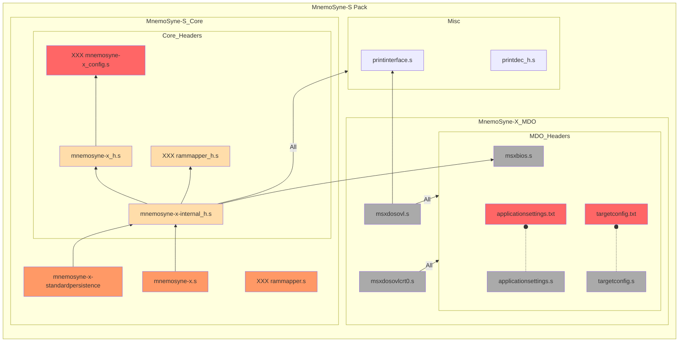

# MnemoSyne-X
Virtual Memory system for MSX.

```mermaid
flowchart
    direction BT
    subgraph MnemoSyne-S Pack
        direction BT

        subgraph MnemoSyne-S_Core
        direction BT

           subgraph Core_Headers
                MS-X-RM_H.S["XXX rammapper_h.s"]:::asmHeader
                MS-X-C_H.S["XXX mnemosyne-x_config.s"]:::cfgHeader
                MS-X_H.S["mnemosyne-x_h.s"]:::asmHeader
                MS-X-I_H.S["mnemosyne-x-internal_h.s"]:::asmHeader
            end

            MS-X.S["mnemosyne-x.s"]:::asmSource
            MS-X-SP.S["mnemosyne-x-standardpersistence"]:::asmSource
            MS-X-RM.S["XXX rammapper.s"]:::asmSource

            MS-X_H.S --> MS-X-C_H.S
            MS-X-I_H.S --> MS-X_H.S
            MS-X-I_H.S --> MS-X-RM_H.S

            MS-X-RM.S ~~~ MS-X-I_H.S
            MS-X.S --> MS-X-I_H.S
            MS-X-SP.S --> MS-X-I_H.S
        end

        subgraph Misc
            PRINTDEC.H["printdec_h.s"]:::miscHeader
            PRINTINTERFACE.S["printinterface.s"]:::miscHeader
        end

        subgraph MnemoSyne-X_MDO
            subgraph MDO_Headers
                MSXBIOS.S["msxbios.s"]:::mdoHeader
                MDO-TARGETCONFIG.TXT["targetconfig.txt"]:::cfgHeader
                MDO-TARGETCONFIG.S["targetconfig.s"]:::mdoHeader
                MDO-APPLICATIONSETTINGS.TXT["applicationsettings.txt"]:::cfgHeader
                MDO-APPLICATIONSETTINGS.S["applicationsettings.s"]:::mdoHeader

                MDO-TARGETCONFIG.TXT ~~~ MSXBIOS.S
                MDO-TARGETCONFIG.S -.-o MDO-TARGETCONFIG.TXT
                MDO-APPLICATIONSETTINGS.TXT ~~~ MSXBIOS.S
                MDO-APPLICATIONSETTINGS.S -.-o MDO-APPLICATIONSETTINGS.TXT
            end


            MDO-CRT0["msxdosovlcrt0.s"]:::mdoSource
            MDO-MSXDOSOVL.S["msxdosovl.s"]:::mdoSource

            MDO-CRT0 ~~~ MDO-MSXDOSOVL.S

            %% MDO-CRT0 --> MSXBIOS.S
            %% MDO-CRT0 --> MDO-APPLICATIONSETTINGS.S
            %% MDO-CRT0 --> MDO-TARGETCONFIG.S

            %% MDO-MSXDOSOVL.S --> MSXBIOS.S
            %% MDO-MSXDOSOVL.S --> MDO-APPLICATIONSETTINGS.S
            %% MDO-MSXDOSOVL.S --> MDO-TARGETCONFIG.S
        end
        
        MnemoSyne-X_MDO ~~~ Misc

        MS-X-I_H.S --> |"All"| Misc
        MS-X-I_H.S --> MSXBIOS.S

        MDO-CRT0  --> |All| MDO_Headers
        MDO-MSXDOSOVL.S  --> |All| MDO_Headers
        MDO-MSXDOSOVL.S  --> PRINTINTERFACE.S

    end

    classDef cfgHeader fill:#f66
    classDef asmSource fill:#f96
    classDef asmHeader fill:#fda
    classDef cSource fill:#f32
    classDef cHeader fill:#f23
    classDef mdoSource fill:#aaa
    classDef mdoHeader fill:#aaa
    
```
