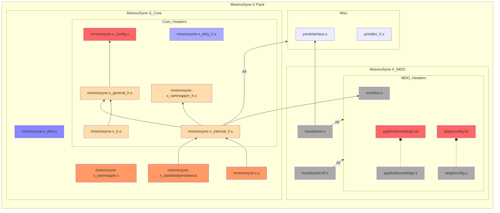

# MnemoSyne-X
## A Virtual Memory system for MSX.

### Version 00.00.01 preview

May, 2024 
Damned Angel

---

## Introduction
MnemoSyne-X is a Virtual Memory System developed for the MSX platform,
designed to provide programmers with a simple interface to manage 
mapped RAM memory effectively and efficiently.

MnemoSyne-X allows for up to 1Gb of addressable memory, divided in 65535
segments of 16kbytes each.

The objective if MnemoSyne-X is to unleash MSX RAM Mapper cababilities,
paving the way for innovative MSX-DOS/Nextor applications and games on
the platform.

---

## Integration
MnemoSyne-X is distributed with a core module integrated in an MDO
(A DLL-like format for MSX - Please Check), as show in the diagram 
below.

The core module may be integrated directly to the MSX-DOS/Nextor
executable, however. Please note that MnemoSyne-X manages segments in
pages 1 and 2, so MnemoSyne-X must sit on pages 0 or 3. The MDO is
designed to be dinamycally loaded in the beginning of page 3.

### MDO
When using MnemoSyne-X in the 
[MDO Basics](https://github.com/DamnedAngel/MSX-Templates-for-VisualStudio/blob/master/doc/manual.md#running-your-msx-dos-program-with-overlays-in-webmsx),
the developer must create an MSX-DOS application with the MSX-DOS
template available
[here](https://github.com/DamnedAngel/MSX-Templates-for-VisualStudio/releases/tag/v00.06.01)
and configure MDO hooks, in __MDOSettings.txt__, as described below:

    ;----------------------------------------------------------
    ;	MDO hooks
    ;	Syntax: MDO_HOOK <C return type>|<hookname>|<C signature>

    ; --- MnemoSyneX ---
    MDO_HOOK		unsigned char|mnemo_init|(bool)
    MDO_HOOK		void|mnemo_finalize|(void)

    MDO_HOOK		void|mnemo_setStdPersistence|(unsigned char)
    MDO_HOOK		void|mnemo_setPersistence|(unsigned char, unsigned int, unsigned int)

    MDO_HOOK		unsigned char|mnemo_activateLogSeg|(LOGSEGHANDLER*)
    MDO_HOOK		unsigned char|mnemo_releaseLogSeg|(unsigned char, LOGSEGHANDLER*)		; SDCCCALL(1)
    MDO_HOOK		unsigned char|mnemo_releaseLogSegHL|(unsigned char, LOGSEGHANDLER*)		; ASM ONLY!!!
    MDO_HOOK		unsigned char|mnemo_releaseAll|(unsigned char)
    MDO_HOOK		unsigned char|mnemo_flushAll|(void)

    MDO_HOOK		void|mnemo_switchAuxPage|(LOGSEGHANDLER*)
    MDO_HOOK		void|mnemo_switchMainPage|(LOGSEGHANDLER*)

    MDO_HOOK		unsigned int |mnemo_getManagedSegments|(void)
    MDO_HOOK		unsigned int |mnemo_getUsedSegments|(void)
    MDO_HOOK		unsigned int |mnemo_getFreeSegments|(void)

Be sure to read the
[MDO Basics](https://github.com/DamnedAngel/MSX-Templates-for-VisualStudio/blob/master/doc/manual.md#running-your-msx-dos-program-with-overlays-in-webmsx)
in to learn how to configure your project to take full advantage
of MDOs,  how to dynamically load the MDO and how to access its
API from your application.

###Inside the executable
In order to directly integrate MnemoSyne-X to your MSX-DOS/Nextor
Application without MDOs, ignore the _mdo_ folder in the package,
include the sources in the diagram above to your project, and use

    .include "mnemosyne-x_h.s"

in your program to access MnemoSyne-X's API.

__In all cases__, remember to configure MnemoSyne-X in _mnemosyne-x_config_h.s_.
More on this in the [Configuration Section](#configuration) below.

---

## DataBanks

**Databanks** are swap files dedicated to holding segment backups. Up to 
256 segments may be stored in one **Databank**, and a maximum of 256
**Databanks** may exist.

Since each segment holds 16kbytes, a maximum 16bytes * 256 * 256 = 1GByte
Virtual Memory may be managed by **MnemoSyne-X**.

Each **Databank** file will be named XXXXXXXX._NN, where:
- XXXXXXXX is a string hardcoded in **MnemoSyne-X** sources; and
- NN is the 0-padded hexadecimal representation of the **Databank** number.

The number of the **Databank** in which a given Logical Segment, among the
64564 possible Logical Segments, will be stored is The Segment Number DIV
256, or the MSByte of the (16-bit) Segment Number. Segments doesn't need
to be stored in order inside a **Databank**; every **Databank** has an
index in its beginning with the references to the Segments withing it. As
a consequence, **Databanks** are pontentially incomplete, meaning that it
is likely that a **Databank** will not be holding the 256 segments it 
could hold.

---

## Memory Architecture

**MnemoSyne-X** will use page 1 and 2 to operate. One of these pages will
be **MnemoSyne-X**'s **MAIN** page and the other **MnemoSyne-X**'s **AUX**
page.

**AUX** page is more easily shared with the application. It is used by
**MnemoSyne-X**'s internal operations, but that should be transparent to 
the programmer and **MnemoSyne-X** will always restore user's segment in
**AUX** page before returning from a service routine (except from 
**_mnemo_switchAuxPage**).

If should be safe to call **MnemoSyne-X**'s API from a user routine in 
**AUX** page.

**MAIN** page is where **MnemoSyne-X** will make segments availble after
allocating them.

The configuration **MNEMO_MAIN_SWAP_PAGE** in **mnemosyne-x_config_h.s**
will define which page will be considered the **MAIN** and **AUX** pages
by **MnemoSyne-X**. Please check the CONFIGURATION SECTION in this
documento for further info.

---

## API

**MnemoSyne-X** provides an API to manage physical and, mainly,
logical segments.

Please find below the complete list of **MnemoSyne-X** API routines.
Note that C headers are also provided to allow direct integration
to C projects (SDCCCALL(1) must be used).

### _mnemo_init

    ; ----------------------------------------------------------------
    ;	- Init MnemoSyne-X.
    ; ----------------------------------------------------------------
    ; INPUTS:
    ;	- A: Use primary mappers only (if MNEMO_PRIMARY_MAPPER_ONLY = 0).
    ;			0 = All mappers
    ;			1 = Primary mapper only
    ;
    ; OUTPUTS:
    ;   - A:  0 = Success
    ;
    ; CHANGES:
    ;   - All registers
    ; ----------------------------------------------------------------

**_mnemo_init** initializes MnemoSyne-X and must be called
before any other accesses to the system. If initialization
succeeds, register A is set to 0. Any other value denotes 
a failure.

### _mnemo_finalize

    ; ----------------------------------------------------------------
    ;	- Finalize MnemoSyne-X.
    ; ----------------------------------------------------------------
    ; INPUTS:
    ;	- None
    ;
    ; OUTPUTS:
    ;   -None
    ;
    ; CHANGES:
    ;   - All registers
    ; ----------------------------------------------------------------

**_mnemo_finalize** finalizes the MnemoSyne-X subsystem and releases
mapper segments. It receives no parameters and returns nothing.

It is a good practice to call **_mnemo_finalize** before exiting to
MSX-DOS/Nextor.

### _mnemo_setStdPersistence

    ; ----------------------------------------------------------------
    ;	- Set a bank to standard persistence
    ; ----------------------------------------------------------------
    ; INPUTS:
    ;	- A: Bank number
    ;
    ; OUTPUTS:
    ;	- None
    ;
    ; CHANGES:
    ;   - All regs
    ; ----------------------------------------------------------------

**_mnemo_setStdPersistence** associates the standard persistence
routines (Load and Save) to a given Databank. Databank number (0-255)
must be especified in register A before calling
**_mnemo_setStdPersistence**.

The standard persistence routines are default for all Databanks.

### _mnemo_setPersistence

    ; ----------------------------------------------------------------
    ;	- Set bank persistence
    ; ----------------------------------------------------------------
    ; INPUTS:
    ;	- A: Bank number
    ;	- DE: pLoadSeg
    ;   - Stack: pSaveSeg
    ;
    ; OUTPUTS:
    ;	- None
    ;
    ; CHANGES:
    ;   - All regs
    ; ----------------------------------------------------------------

**_mnemo_setPersistence** associates custom persistence routines
(Load and Save) to a given Databank. Pior to calling
**_mnemo_setPersistence**, Databank number (0-255) must be especified
in register A, DE must point to the custom segment load routine 
(pLoadSeg) and the address of the custom segment load routine
(pSaveSeg) must be pushed to the stack.

In order to comply to SSDCCCALL(1) standard, **_mnemo_setPersistence**
will clean pSaveSeg from the stack. The callee doesn't need to bother
with it.

### _mnemo_activateLogSeg

    ; ----------------------------------------------------------------
    ;	- Activates a logical segment
    ; ----------------------------------------------------------------
    ; INPUTS:
    ;	- HL: pointer to logical segment handler
    ;
    ; OUTPUTS:
    ;   - A:  0 = Success
    ;
    ; CHANGES:
    ;   - All registers
    ; ----------------------------------------------------------------

**_mnemo_activateLogSeg** allocates a logical segment. HL must
point to a Logical Segment Handler.

The Logical Segment Handler is defined as:

    typedef struct {
    	SEGHANDLER segHandler;
    	SEGHANDLER* pSegHandler;
    	void* pLogSegTableItem;
    	unsigned int logSegNumber;
    	unsigned char segMode;
    } LOGSEGHANDLER;

The (physical) Segment Handler (SEGHANDLER) is defined as:

    typedef struct {
    	unsigned char segNumber;
    	unsigned char mapperSlot;
    } SEGHANDLER;

Upon calling **_mnemo_activateLogSeg**, the only relevant fields
in the Logical Segment Handler pointed by HLthat must be filled 
are **logSegNumber**, a number between 0 and 65364, and 
**segMode**, the mode the segment will operate. The possible modes
are:

    MNEMO_SEGMODE_TEMP				= 0
    MNEMO_SEGMODE_READ				= 1
    MNEMO_SEGMODE_FORCEDREAD		= 2
    MNEMO_SEGMODE_READWRITE			= 3

**MNEMO_SEGMODE_TEMP (0)** indicates that the segment will not be
saved to or retrieved from disk. Once released, the data is simply
discarded when MnemoSyne-X needs to reuse the physical segment.

**MNEMO_SEGMODE_READ (1)** signifies that the segment will be read
from disk if a persisted version is found on Databanks each time the
segment is allocated. After the segment has been released:
- Upon reallocation:
  - If the segment remains consistent, MnemoSyne-X will make it available again upon reallocation.
  - If the segment is no longer available, MnemoSyne-X will reread data from disk (if available).
- When MnemoSyne-X needs to reuse the physical segment, the data is discarded.

**MNEMO_SEGMODE_FORCEDREAD (2)** indicates that the segment will be
read from disk every time it's allocated or reallocated, even if the
in-memory segment is still consistent. This is useful for reloading
game levels after gameplay destroys them. Upon release, when
**MnemoSyne-X** needs to reuse the physical segment, the data is
discarded.

**MNEMO_SEGMODE_WRITE (3)** means that the segment will be read from
disk upon allocation and, after release, when **MnemoSyne-X** needs
to reuse the physical segment, the data is persisted to Databanks.

Upon successful allocation, register A is set to 0, the remaining
fields of the Logical Segment Handler are populated (typically, of no
concern to the programmer), and the newly allocated segment will be
made available for use in **MnemoSyne-X**'s MAIN page (see 
CONFIGURATION SECTION). Any other value returned in register A
indicates either failure (bit 7 set) or a warning (bit 7 reset).

### _mnemo_releaseLogSeg

    ; ----------------------------------------------------------------
    ;	- Releases segment from a logSegHandler pointed by DE
    ; ----------------------------------------------------------------
    ; INPUTS:
    ;	- A: Release priority
    ;	- DE: pLogSegHandler
    ;
    ; OUTPUTS:
    ;   - None
    ;
    ; CHANGES:
    ;   - All registers
    ; ----------------------------------------------------------------

**_mnemo_releaseLogSeg** releases logical segment from the
segment pool. Register A must specify the release priority and DE
must point to the Logical Segment Handler to be released.

The release priority are the following:

    MNEMO_ALLOC_KEEPPRIORITY0				= 0b00000000	; lowest priority
    MNEMO_ALLOC_KEEPPRIORITY1				= 0b00010000	
    MNEMO_ALLOC_KEEPPRIORITY2				= 0b00100000	; highest priority

After a segment is released, **MnemoSyne-X** will do its best to
keep the segment consistent and in memory, in order to avoid the
need to persist it to Databanks and to reload it afterwards. To
do so, **MnemoSyni-X** will give preference to use unused physical
segments, then reuse segments released with
NEMO_ALLOC_KEEPPRIORITY0 segments, then segments released with 
MNEMO_ALLOC_KEEPPRIORITY1, and then segments released with 
MNEMO_ALLOC_KEEPPRIORITY2. Thus, it is very important, 
performace-wise, to choose properly the release priority when 
releasing segments.

### mnemo_releaseLogSegHL

    ; ----------------------------------------------------------------
    ;	- Releases segment from a logSegHandler pointed by HL
    ; ----------------------------------------------------------------
    ; INPUTS:
    ;	- A: Release priority (0 - 2)
    ;	- HL: pointer to logical segment handler
    ;
    ; OUTPUTS:
    ;   - A: Error code
    ;
    ; CHANGES:
    ;   - All registers
    ; ----------------------------------------------------------------

Same as above, but the Logical Segment Handler is passed on HL.

### _mnemo_releaseAll
    ; ----------------------------------------------------------------
    ;	- Releases all active segments
    ; ----------------------------------------------------------------
    ; INPUTS:
    ;	- A: Release priority (0 - 2)
    ;
    ; OUTPUTS:
    ;   - None
    ;
    ; CHANGES:
    ;   - All registers
    ; ----------------------------------------------------------------

**_mnemo_releaseAll** will scan the physical segments pool and release
every active logical segment it finds. The release priority for all
these segments shall be passed on register A.

## _mnemo_flushAll

    ; ----------------------------------------------------------------
    ;	- Flushes all pending, released segments to disk
    ; ----------------------------------------------------------------
    ; INPUTS:
    ;	- None
    ;
    ; OUTPUTS:
    ;   - A: Error code
    ;
    ; CHANGES:
    ;   - All registers
    ; ----------------------------------------------------------------

**_mnemo_flushAll** will release and persist all non-persisted
segments with mode MNEMO_SEGMODE_READWRITE to disk. If the flush
process succeeds, register A is set to 0. Any other value denotes 
a failure.

### _mnemo_switchAuxPage

    ; ----------------------------------------------------------------
    ;	- Enable a segment from a Segment Handler in aux page
    ; ----------------------------------------------------------------
    ; INPUTS:
    ;	- HL: pointer to Segment handler
    ;
    ; OUTPUTS:
    ;   - None
    ;
    ; CHANGES:
    ;   - All registers
    ; ----------------------------------------------------------------

**_mnemo_switchAuxPage** will make the Logical Segment associated with
the Logical Segment Handler passed on HL available on **MnemoSyne-X**'s
AUX page (see OPERATION SECTION).

### _mnemo_switchMainPage

    ; ----------------------------------------------------------------
    ;	- Enable a segment from a Segment Handler in main page
    ; ----------------------------------------------------------------
    ; INPUTS:
    ;	- HL: pointer to Segment handler
    ;
    ; OUTPUTS:
    ;   - None
    ;
    ; CHANGES:
    ;   - All registers
    ; ----------------------------------------------------------------

**_mnemo_switchMainPage** will make the Logical Segment associated with
the Logical Segment Handler passed on HL available on **MnemoSyne-X**'s
MAIN page (see OPERATION SECTION).

### _mnemo_getManagedSegments
    ; ----------------------------------------------------------------
    ;	- Get number of Managed Physical Segments
    ; ----------------------------------------------------------------
    ; INPUTS:
    ;	- None
    ;
    ; OUTPUTS:
    ;   - DE: number of Managed Physical Segments
    ;
    ; CHANGES:
    ;   - Nothing
    ; ----------------------------------------------------------------

**_mnemo_getManagedSegments** will return the numbers of physical 
segments reserved to manage logical segments.

### _mnemo_getUsedSegments
    ; ----------------------------------------------------------------
    ;	- Get number of Used Managed Physical Segments
    ; ----------------------------------------------------------------
    ; INPUTS:
    ;	- None
    ;
    ; OUTPUTS:
    ;   - DE: number of Used Managed Physical Segments
    ;
    ; CHANGES:
    ;   - Nothing
    ; ----------------------------------------------------------------

**_mnemo_getUsedSegments** will return the numbers of physical 
segments used to manage logical segments.

### _mnemo_getFreeSegments
    ; ----------------------------------------------------------------
    ;	- Get number of Free Managed Physical Segments
    ; ----------------------------------------------------------------
    ; INPUTS:
    ;	- None
    ;
    ; OUTPUTS:
    ;   - DE: Number of free segments
    ;
    ; CHANGES:
    ;   - HL
    ; ----------------------------------------------------------------

**_mnemo_getFreeSegments** will return the number of free physical 
segments. When no free physical segments are available, attempts
to allocate new logical segments will fail.

---

## Configuration

**MnemoSyne-X** build and operation may be configured with some
settings in the **mnemosyne-x_config_h.s** file.

The possible configurations are:

### MNEMO_MAIN_SWAP_PAGE
This defines **MnemoSyne-X** **MAIN** page (please chech Memory Architecture Section),
which can be page 1 or 2. A value "1" will make **MAIN** page 1, and **AUX** page 2.
Anything else will make **MAIN** page 2 and **AUX** page 1.

### MNEMO_INDEX_SEGMENTS
This determines how many physical segments will be allocated to manage Logical
Segments. Every physical segment will hold 8k Logical Segments, which corresponds
to 128Mbytes of Virtual Memory.
The minimum valid value is 1 physical segment, for an operation of 8k Logical Segments
and a total of 128Mbytes of Virtual Memory. The maximum value is 8 physical segments,
for an operation of 64k segments (minus one, since segment Number 0xFFFF is used by
**MnemoSyne-X** as an indicator of invalid Logical Segment) and a total of 1Gbytes of
Virtual Memory.

### MNEMO_PRIMARY_MAPPER_ONLY
0 will make **MnemoSyne-X** use all RAM memory mappers it finds. 1 will make
**MnemoSyne-X** to use onlye the primary mapper.
Using all mappers available will bring memory swaps to a minimum, but segment 
allocation, release and switch operations will be slightly heavier, and 
**MnemoSyne-X** subsystem footprint will be slightly bigger.
Using the primary mappers only will make **MnemoSyne-X** fotprint slightly
smaller and operations will be slightly slower, but memory swap will be
maximized. Limiting to primary mapper may also be even more performatic on the 
Turbo Rs, since their primary mapper is reasonably faster.

### MNEMO_MAX_PHYSICAL_SEGMENTS
If, for any reason, the programmer wants to establish an upper limit for the number
of physical segments available to the Virtual Memory system, this can be configured
in **MNEMO_MAX_PHYSICAL_SEGMENTS**. The possible values for this setting is from 1 
to 3072 (that is, 48Mbytes max of physical RAM).

---

## Dirty Operations
Dirty operations are dangerous, but significantly faster segment/slot switch
operations.

Don't use Dirty Operations yet. They were implemented but not tested in any way.
They are already included in the pack for the curious and for the masochists only.

---

## Final notes

- There currently is no way of deleting segments within Databanks. Data may be "erased" by overriding a segment with new data or with junk data.
- 